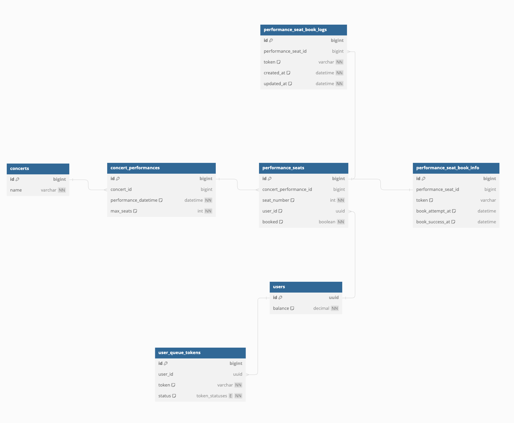
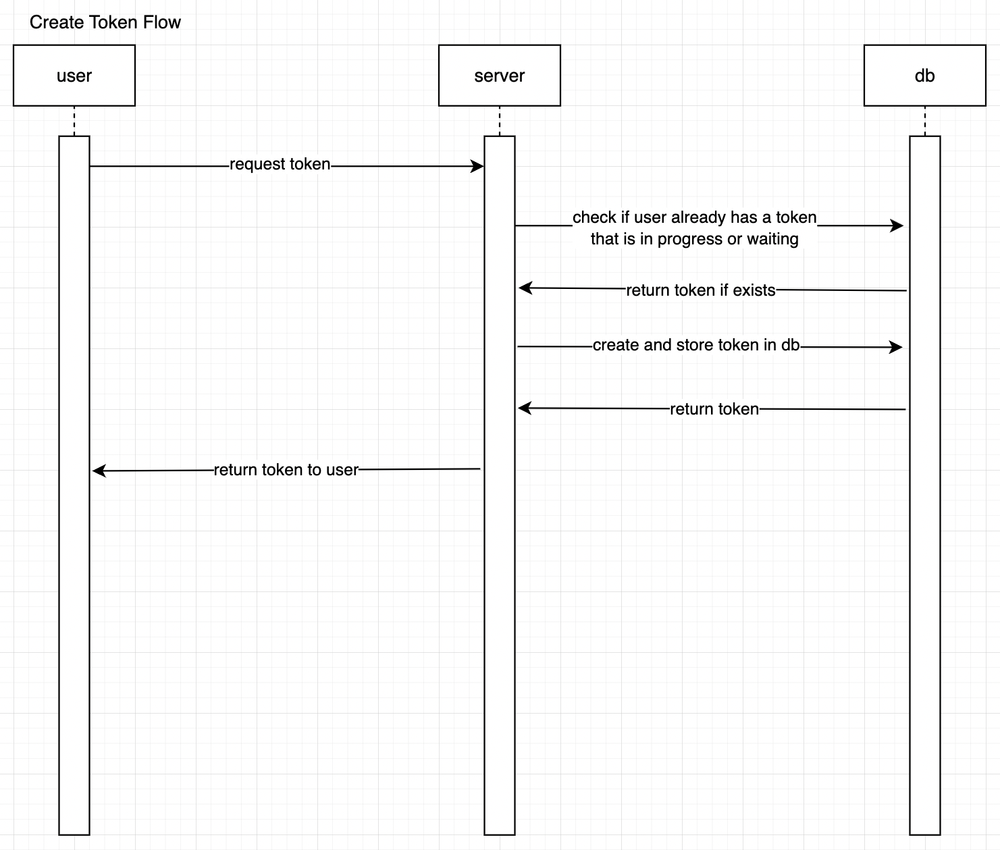
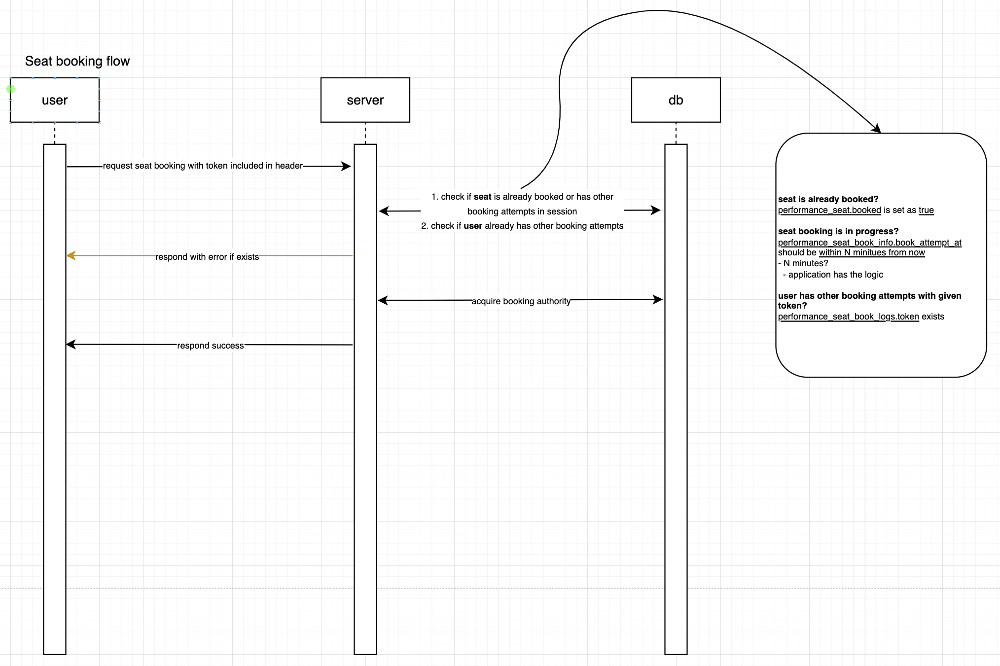

## 1. ERD



### dbdiagram.io
```sql
Table users as U {
  id uuid [pk]
  balance decimal [not null, default: 0] 
}

enum token_statuses {
  IN_QUEUE
  IN_PROGRESS
  EXPIRED
}

Table user_queue_tokens as UQT {
  id bigint [pk]
  user_id uuid [ref: > U.id]
  token varchar [not null, unique, note: '유저의 id와 생성 시간을 합친 값을 MD5하여 만듬']
  status token_statuses [not null, default: `token_statuses.IN_QUEUE`]
}

Table concerts as C {
  id bigint [pk]
  name varchar [not null]
}

Table concert_performances as CP {
  id bigint [pk]
  concert_id bigint [ref: > C.id]
  performance_datetime datetime [not null, default: `now()`]
  max_seats int [not null, default: 0]
}

Table performance_seats as PS {
  id bigint [pk]
  concert_performance_id bigint [ref: > CP.id]
  seat_number int [not null, default: 0]
  user_id uuid [null, ref: > U.id, note: '좌석을 예약 성공한 유저']
  booked boolean [not null, default: false]
}

Table performance_seat_book_info as PSBI {
  id bigint [pk]
  performance_seat_id bigint [ref: - PS.id]
  token varchar [null, note: 'performance_seat 생성후 시도된 좌석 예약이 없을 경우 null 가능']
  book_attempt_at datetime [null, note: '좌석 예약 대기를 걸어둔 시간']
  book_success_at datetime [null, note: '좌석 예약에 성공한 시간']
}

Table performance_seat_book_logs as PSBL {
  id bigint [pk]
  performance_seat_id bigint [ref: > PS.id]
  token varchar [not null, note: '예약 시도를 위해 사용한 대기열 토큰']
  created_at datetime [not null, default: `now()`]
  updated_at datetime [not null, default: `now()`]
}
```

## 2. Sequence Diagram

### 대기열 토큰 발급



### 좌석 예약 요청




## 3. API 명세서

### 토큰 없이 사용 가능 API 목록

#### 대기열 토큰 발급: POST /user_queue_tokens
- Request
  - user_id: UUID
  - Content-Type: application/json
  - Body: 
    ```json
    {
      "user_id": "UUID"
    }
    ```
- Response
  - 201 Created
    - Content-Type: application/json
    - Body:
      ```
      {
        "token": "TOKEN"
      }
      ```
  - 400 Bad Request
    - Content-Type: application/json
    - Body:
      ```
      {
        "message": "User not found"
      }
      ```
    - explanation
      - `user_id`에 해당하는 사용자가 존재하지 않음
- Note
  - 이후 사용되는 API 호출 시, `token`을 헤더에 `X-Reservation-Token`으로 전달해야 함

#### 유저 잔액 충전: POST /users/{user_id}/charge
- Request
  - user_id: UUID
  - amount: Decimal
  - Content-Type: application/json
  - Header: X-Reservation-Token: {token}
  - Body:
    ```json
    {
      "amount": 100.0
    }
    ```
- Response
  - 200 OK
    - Content-Type: application/json
    - Body:
      ```
      {
        "result": true
      }
      ```
  - 404 Not Found
    - Content-Type: application/json
    - Body:
      ```
      {
        "message": "User not found"
      }
      ```
    - explanation
      - `user_id`에 해당하는 사용자가 존재하지 않음

#### 유저 정보 조회 (잔액 조회, 예약 성공한 좌석 조회시 사용): GET /users/{user_id}
- Request
  - user_id: UUID
  - Content-Type: application/json
  - Header: X-Reservation-Token: {token}
  - Body: None
- Response
  - 200 OK
    - Content-Type: application/json
    - Body:
      ```
      {
        "id": "UUID",
        "balance": 100.0,
        "booked_performance_seats": [
          {
            "id": 1,
            "seat_number": 1,
            "book_success_at": "2024-04-01T00:00:00"
            "concert_performance": {
              "id": 1,
              "concert": {
                "id": 1,
                "name": "콘서트명"
              },
              "performance_datetime": "2024-04-01T00:00:00"
            }
          }
        ]
      }
      ```
  - 404 Not Found
    - Content-Type: application/json
    - Body:
      ```
      {
        "message": "User not found"
      }
      ```
    - explanation
      - `user_id`에 해당하는 사용자가 존재하지 않음

---

### 토큰이 필요한 API 목록

#### 공통 response
- 401 Unauthorized
  - Content-Type: application/json
  - Body:
    ```
    {
      "message": "Token is invalid"
    }
    ```
  - explanation
    - `token`이 유효하지 않음 

#### 대기열 토큰으로 정보 조회: GET /user_queue_tokens/token_info
- Request
  - token: String
  - Content-Type: application/json
  - Header: X-Reservation-Token: {token}
  - Body: None
- Response
  - 200 OK
    - Content-Type: application/json
    - Body:
      ```
      {
        "user_id": "UUID",
        "status": "one of (IN_QUEUE, IN_PROGRESS, EXPIRED)",
        "performance_seat_book_info": { // nullable
          "id": 1,
          "performance_seat_id": 1,
          "book_attempt_at": "2024-04-01T00:00:00",
          "book_success_at": null
        }
      }
      ```

#### 콘서트 목록 조회: GET /concerts
- Request
  - Content-Type: application/json
  - Header: X-Reservation-Token: {token}
  - Body: None
- Response
  - 200 OK
    - Content-Type: application/json
    - Body:
      ```
      [
        {
          "id": 1,
          "name": "콘서트명"
        }
      ]
      ```

#### 콘서트 예약 가능 날짜 조회: GET /concert_performances?concert_id={concert_id}
- Request
  - concert_id: Long
  - Content-Type: application/json
  - Header: X-Reservation-Token: {token}
  - Body: None
- Response
  - 200 OK
    - Content-Type: application/json
    - Body:
      ```
      [
        {
          "id": 1,
          "concert_id": 1,
          "max_seats": 50,
          "performance_datetime": "2024-04-01T00:00:00"
        }
      ]
      ```
  - 404 Not Found
    - Content-Type: application/json
    - Body:
      ```
      {
        "message": "Concert not found"
      }
      ```
    - explanation
      - `concert_id`에 해당하는 콘서트가 존재하지 않음
- Note
  - `max_seats`는 해당 콘서트 날짜에 대한 총 좌석 수
  - `performance_datetime`은 콘서트 날짜 및 시간
  - 빈 목록일 경우 해당 콘서트에 대한 예약이 모두 완료되었거나 예약이 불가능한(예: 공연 시작 시간이 지난 경우) 상태

#### 예약 가능한 좌석 조회: GET /performance_seats?concert_date_id={concert_date_id}
- Request
  - concert_date_id: Long
  - Content-Type: application/json
  - Header: X-Reservation-Token: {token}
  - Body: None
- Response
  - 200 OK
    - Content-Type: application/json
    - Body:
      ```
      [
        {"id": 1, "concert_performance_id": 1, "seat_number": 1, "booked": false},
        {"id": 2, "concert_performance_id": 1, "seat_number": 2, "booked": true}
      ]
      ```
  - 404 Not Found
    - Content-Type: application/json
    - Body:
      ```
      {
        "message": "Concert date not found"
      }
      ```
    - explanation
      - `concert_date_id`에 해당하는 콘서트 날짜가 존재하지 않음

#### 좌석 예약 요청: POST /performance_seats/{id}/book
- Request
  - id: Long
  - Content-Type: application/json
  - Header: X-Reservation-Token: {token}
  - Body: None
- Response
  - 201 Created
    - Content-Type: application/json
    - Body:
      ```
      {
        "performance_seat_id": 1,
        "book_attempt_at": "2024-04-01T00:00:00" // 예약 시도 시간
      }
      ```
  - 400 Bad Request
    - Content-Type: application/json
    - Body:
      ```
      {
        "message": "Seat is already booked"
      }
      ```
    - explanation
      - 해당 좌석이 이미 예약 완료되었음
  - 404 Not Found
    - Content-Type: application/json
    - Body:
      ```
      {
        "message": "Performance seat not found"
      }
      ```
    - explanation
      - `id`에 해당하는 좌석이 존재하지 않음 
  - 409 Conflict
    - Content-Type: application/json
    - Body:
      ```
      {
        "message": "User already has a reservation"
      }
      ```
    - explanation
      - `token`에 해당하는 사용자가 이미 예약중인 좌석이 있음
  - 409 Conflict
    - Content-Type: application/json
    - Body:
      ```
      {
         "message": "Other user is booking the seat"
      }
      ```
    - explanation
      - 해당 `id`에 해당하는 좌석을 예약중인 사용자가 있음 

#### 콘서트 예약 결제 요청: POST /performance_seats/{id}/pay
- Request
  - id: Long
  - Content-Type: application/json
  - Header: X-Reservation-Token: {token}
  - Body: None
- Response
  - 200 OK
    - Content-Type: application/json
    - Body:
      ```
      {
        "id": 1,
        "concert_performance_id": 1,
        "seat_number": 1,
        "user_id": "UUID",
        "booked": true
      }
      ```
  - 400 Bad Request
    - Content-Type: application/json
    - Body:
      ```
      {
        "message": "Queue expired"
      }
      ```
    - explanation
      - N분의 예약시간을 초과하여 예약이 불가능함
  - 403 Bad Request
    - Content-Type: application/json
    - Body:
      ```
      {
        "message": "Insufficient balance"
      }
      ```
    - explanation
      - 사용자의 잔액이 부족하여 결제가 불가능함
  - 404 Not Found
    - Content-Type: application/json
    - Body:
      ```
      {
        "message": "Performance seat not found"
      }
      ```
    - explanation
      - `id`에 해당하는 좌석이 존재하지 않음


