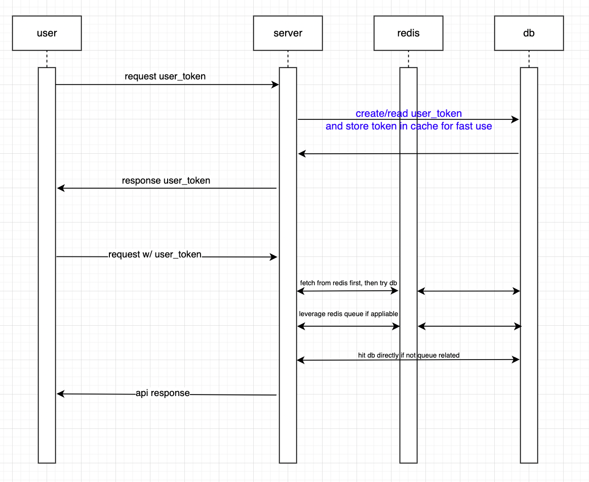

## 1. ERD


### dbdiagram.io
```sql
Table users as U {
  id uuid [pk]
  balance int [default: 0]
}

enum balance_types {
  CHARGE
  USE
}
Table user_balance_histories as UBH {
  id bigint [pk]
  user_id uuid [ref: > U.id]
  balance_type balance_types [not null]
  amount int [not null]
  owner_id bigint [note: '사용처 테이블 id']
  owner_type varchar [note: '사용처 테이블 모델명']
}

Table concerts as C {
  id bigint [pk]
  name varchar
}

Table concert_dates as CD {
  id bigint [pk]
  concert_id bigint [ref: > C.id]
  max_seats int [default: 0, note: '최대 수용 인원수']
  date datetime [default: 'now()', note: '콘서트 실행 날짜 및 시간']
}

Table concert_date_seats as CDS {
  id bigint [pk]
  concert_date_id bigint [ref: > CD.id]
  seat_number int [default: 0]
  user_id uuid [null, ref: > U.id]
  reserved bool [default: false]
}

Table user_tokens as UT {
  id bigint [pk]
  user_id uuid [ref: > U.id]
  token varchar
}

enum queue_progresses {
  WAITING
  IN_PROGRESS
  CONFIRMED
  FORFEITED
}

Table concert_date_seat_queues as CDSQ {
  id bigint [pk]
  concert_date_seat_id bigint [ref: > CDS.id]
  user_token_id bigint [ref: > UT.id]
  progress queue_progresses [not null]
}
```

## 2. Sequence Diagram



## 3. API 명세서

### 대기열 토큰 발급: POST /user_tokens
- Request
  - user_id: UUID
  - Content-Type: application/json
  - Body: 
    ```json
    {
      "user_id": "UUID"
    }
    ```
- Response
  - 201 Created
    - Content-Type: application/json
    - Body:
      ```
      {
        "user_token": "TOKEN"
      }
      ```
  - 400 Bad Request
    - Content-Type: application/json
    - Body:
      ```
      {
        "message": "User not found"
      }
      ```
    - explanation
      - `user_id`에 해당하는 사용자가 존재하지 않음
  - 409 Conflict
    - Content-Type: application/json
    - Body:
      ```
      {
        "message": "User already has a token"
      }
      ```
    - explanation
      - `user_id`에 해당하는 사용자가 이미 대기열 토큰을 발급받은 상태 (대기열 토큰은 한 사용자당 하나만 발급 가능)
- Note
  - 이후 사용되는 API 호출 시, `token`을 헤더에 `X-Reservation-Token`으로 전달해야 함

### 공통 response
- 403 Forbidden
  - Content-Type: application/json
  - Body:
    ```
    {
      "message": "Token is invalid"
    }
    ```
  - explanation
    - `token`이 유효하지 않음 (대기열 토큰이 아니거나, 만료됨) 

### 대기열 토큰으로 정보 조회: GET /user_tokens/{token}
- Request
  - token: String
  - Content-Type: application/json
  - Header: X-Reservation-Token: {token}
  - Body: None
- Response
  - 200 OK
    - Content-Type: application/json
    - Body:
      ```
      {
        "user_id": "UUID",
        "reserving_concert": { // null if not reserving
          "concert_id": 1,
          "concert_name": "콘서트명",
          "concert_date": "2024-04-01T00:00:00",
          "seat_number": 1,
          "order_in_queue": 1
        }
      }
      ```

### 콘서트 목록 조회: GET /concerts
- Request
  - Content-Type: application/json
  - Header: X-Reservation-Token: {token}
  - Body: None
- Response
  - 200 OK
    - Content-Type: application/json
    - Body:
      ```
      [
        {
          "id": 1,
          "name": "콘서트명"
        }
      ]
      ```

### 콘서트 날짜별 좌석 조회: GET /concerts/{concert_id}/available_concert_dates
- Request
  - concert_id: Long
  - Content-Type: application/json
  - Header: X-Reservation-Token: {token}
  - Body: None
- Response
  - 200 OK
    - Content-Type: application/json
    - Body:
      ```
      [
        {
          "id": 1,
          "concert_id": 1,
          "max_seats": 50,
          "date": "2024-04-01T00:00:00"
        }
      ]
      ```
  - 404 Not Found
    - Content-Type: application/json
    - Body:
      ```
      {
        "message": "Concert not found"
      }
      ```
    - explanation
      - `concert_id`에 해당하는 콘서트가 존재하지 않음
- Note
  - `seats`는 해당 콘서트 날짜에 대한 총 좌석 수
  - `date`는 콘서트 날짜 및 시간
  - 빈 목록일 경우 해당 콘서트에 대한 예약이 모두 완료되었거나 예약이 불가능한(예: 공연 시작 시간이 지난 경우) 상태

### 예약 가능한 좌석 조회: GET /concert_dates/{concert_date_id}/available_seat_numbers
- Request
  - concert_date_id: Long
  - Content-Type: application/json
  - Header: X-Reservation-Token: {token}
  - Body: None
- Response
  - 200 OK
    - Content-Type: application/json
    - Body:
      ```
      [
        1,
        2,
        3
      ]
      ```
  - 404 Not Found
    - Content-Type: application/json
    - Body:
      ```
      {
        "message": "Concert date not found"
      }
      ```
    - explanation
      - `concert_date_id`에 해당하는 콘서트 날짜가 존재하지 않음

### 좌석 예약 요청: POST /concert_date_seat_queues
- Request
  - concert_date_id: Long
  - seat_number: Integer
  - Content-Type: application/json
  - Header: X-Reservation-Token: {token}
  - Body:
    ```json
    {
      "concert_date_id": 1,
      "seat_number": 1
    }
    ```
- Response
  - 201 Created
    - Content-Type: application/json
    - Body:
      ```
      {
        "result": true
      }
      ```
  - 400 Bad Request
    - Content-Type: application/json
    - Body:
      ```
      {
        "message": "Seat is already reserved"
      }
      ```
    - explanation
      - 해당 좌석이 이미 예약 완료되었음
  - 404 Not Found
    - Content-Type: application/json
    - Body:
      ```
      {
        "message": "{Concert date OR seat} not found"
      }
      ```
    - explanation
      - `concert_date_id`에 해당하는 콘서트 날짜가 존재하지 않거나, `seat_number`에 해당하는 좌석이 존재하지 않음 
  - 409 Conflict
    - Content-Type: application/json
    - Body:
      ```
      {
        "message": "User already has a reservation"
      }
      ```
    - explanation
      - `token`에 해당하는 사용자가 이미 예약중인 좌석이 있음

### 유저 정보 조회: GET /users/{user_id}
- Request
  - user_id: UUID
  - Content-Type: application/json
  - Header: X-Reservation-Token: {token}
  - Body: None
- Response
  - 200 OK
    - Content-Type: application/json
    - Body:
      ```
      {
        "id": "UUID",
        "balance": 100
      }
      ```
  - 404 Not Found
    - Content-Type: application/json
    - Body:
      ```
      {
        "message": "User not found"
      }
      ```
    - explanation
      - `user_id`에 해당하는 사용자가 존재하지 않음

### 유저 잔액 충전: POST /users/{user_id}/charge
- Request
  - user_id: UUID
  - amount: Integer
  - Content-Type: application/json
  - Header: X-Reservation-Token: {token}
  - Body:
    ```json
    {
      "amount": 100
    }
    ```
- Response
  - 200 OK
    - Content-Type: application/json
    - Body:
      ```
      {
        "result": true
      }
      ```
  - 404 Not Found
    - Content-Type: application/json
    - Body:
      ```
      {
        "message": "User not found"
      }
      ```
    - explanation
      - `user_id`에 해당하는 사용자가 존재하지 않음

### 콘스터 예약 결제 요청: POST /concert_date_seat_queues/{id}/confirm
- Request
  - id: Long
  - Content-Type: application/json
  - Header: X-Reservation-Token: {token}
  - Body: None
  - Note
    - `id`는 `concert_date_seat_queues` 테이블의 `id` 필드
- Response
  - 200 OK
    - Content-Type: application/json
    - Body:
      ```
      {
        "result": true
      }
      ```
  - 400 Bad Request
    - Content-Type: application/json
    - Body:
      ```
      {
        "message": "Insufficient balance"
      }
      ```
    - explanation
      - 사용자의 잔액이 부족하여 결제가 불가능함
  - 400 Bad Request
    - Content-Type: application/json
    - Body:
      ```
      {
        "message": "Queue expired"
      }
      ```
    - explanation
      - `id`에 해당하는 예약 대기열이 시간을 초과하여 예약이 불가능함
  - 404 Not Found
    - Content-Type: application/json
    - Body:
      ```
      {
        "message": "Queue not found"
      }
      ```
    - explanation
      - `id`에 해당하는 예약 대기열이 존재하지 않음
